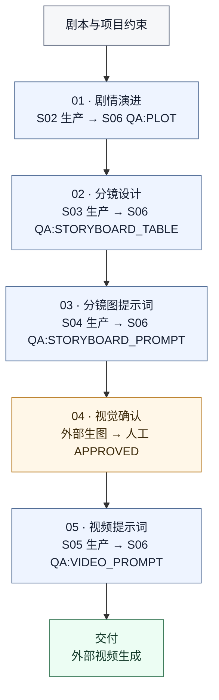

# Video Drama Skill Cluster

## 但是我希望我们做出来的AI短剧能符合视听语言的逻辑，同时要是短剧的节奏和短剧运镜，如果你不知什么是短剧的节奏和短剧的运镜我可以给你资料，我们最终的目的是制作出来让人看不出来是AI制作的短剧，就像是真人实拍的一样，但是画面、场景、特效是实拍不能轻易做到的

一套面向 AI 短剧制作的 Codex Skill 集群，把剧本拆解、剧情演进、分镜设计、分镜图提示词、视频提示词和统一 QA 串成可追踪、可返修的生产流水线。

它关注的不是一次性生成结果，而是让每一阶段都有明确输入、版本、来源、状态和验收门槛，适合需要连续制作、多轮修改和质量控制的短剧项目。

## 核心能力

- 用中央流程导演管理 P1–P7 阶段、产物版本和下一步路由。
- 将原始剧本拆成因果连续、可追踪的剧情 BEAT。
- 把已通过 QA 的剧情演进转换成固定九列分镜表。
- 将分镜表逐镜转译成静态分镜图提示词。
- 基于人工确认的分镜图生成可投喂 Seedance 的视频提示词。
- 对各阶段产物执行独立 QA，并输出 `PASS`、`REPAIR` 或 `HUMAN_GATE`。
- 通过 `RepairTicket`、`ChangeSet` 和局部 `STALE` 控制返修范围，减少无关内容被重做。

## 工作流

S01 是整条流水线的编排层，负责判断当前阶段、核对版本并选择下一步；它不直接生产阶段产物。主生产链路如下：



阅读规则很简单：每个生产阶段都要经过 S06 QA，`PASS` 才向下推进；`REPAIR` 只返回当前阶段做最小范围返修。分镜图是唯一额外需要人工 `APPROVED` 的门禁。

实际生图和视频生成不包含在本仓库中；S04、S05 负责生产结构化提示词，S01 负责调度对应的外部工具。

## Skill 一览

| 阶段 | Skill | 职责 | 主要产物 |
| --- | --- | --- | --- |
| S01 | `short-drama-flow-director` | 中央编排、状态管理、版本追踪、路由与人工门禁 | 流程状态包、调度决策 |
| S02 | `script-plot-progression` | 剧本事实提取、场次划分、剧情 BEAT 与连续性整理 | `PlotProgressionSpec` |
| S03 | `storyboard-table-director` | 景别、机位、运镜、表演和时长设计 | `StoryboardTable` |
| S04 | `storyboard-image-prompt-director` | 单镜静态瞬间、构图、资产绑定和生图提示词 | `StoryboardPromptSpec` |
| S05 | `video-prompt-director` | 动作、对白、摄影、光影、声音和镜尾组织 | `VideoPromptSpec` |
| S06 | `short-drama-unified-qa` | 独立审查 S02–S05 及分镜图产物，签发返修工单 | QA verdict、`RepairTicket` |

## 目录结构

```text
skills/
├── _shared/                         # 跨阶段公共契约和校验器
├── short-drama-flow-director/       # S01
├── script-plot-progression/         # S02
├── storyboard-table-director/       # S03
├── storyboard-image-prompt-director/ # S04
├── video-prompt-director/           # S05
├── short-drama-unified-qa/          # S06
└── tests/                           # 集群级回归测试
```

每个 skill 通常包含：

- `SKILL.md`：触发条件、职责边界和执行流程。
- `agents/openai.yaml`：界面元数据与默认提示。
- `references/`：阶段规范、数据契约、连续性规则和案例。
- `scripts/`：机械校验器及相关测试。

## 安装

先克隆仓库：

```powershell
git clone https://github.com/shiqiandiandianda/video-drama.git
Set-Location .\video-drama
```

然后把 `skills` 下的内容复制到个人 Codex skills 目录。Windows PowerShell 示例：

```powershell
New-Item -ItemType Directory -Force "$env:USERPROFILE\.codex\skills" | Out-Null
Copy-Item -Recurse -Force .\skills\* "$env:USERPROFILE\.codex\skills\"
```

`_shared` 必须和 6 个 skill 目录一起复制，因为生产 skill 会读取其中的公共流水线契约和校验脚本。

## 使用方式

必须从 S01 流程导演启动或继续整条流水线，例如：

```text
启动一个新的 AI 短剧项目。先登记剧本和项目约束，再告诉我当前阶段、缺少的输入以及下一步合法动作。
```

即使已有权威上游产物，也要交给 S01 判断阶段并签发一次性派工授权：

```text
把这个已通过 QA 的 PlotProgressionSpec 登记到当前项目，并由 S01 推进到下一合法阶段。
```

```text
把这份 VideoPromptSpec 登记到当前 S01 状态；只有派工授权和产物来源匹配时，调用 QA:VIDEO_PROMPT。
```

禁止绕过 S01 单独调用生产或 QA skill 直接产出。S01 为每次生产签发 `FlowAuthorization`；S02-S05 没有匹配授权时只返回 `FLOW_DISPATCH_REQUIRED`。S06 会再次核验完整 S01 状态、当前 `CALL_QA`、产物 `flow_authorization_id` 和已消费授权，任何不一致都不能放行。

## 关键约束

- 上游事实优先，禁止无依据扩写剧情或改写原始对白。
- 每个产物都携带可追踪的来源 ID、版本和状态。
- 每个生产产物都携带可追踪的 S01 `flow_authorization_id`，且授权不得跨阶段、范围或版本复用。
- QA 与生产职责分离；S06 只审查和路由，不直接修改生产产物。
- 分镜图必须经过人工 `APPROVED`，S05 才能生成最终视频提示词。
- 视频提示词必须逐人明确屏幕横向、景深层、世界锚点、朝向/视线和人物间位置关系；缺失或只写“保持站位”时 S06 必须要求返修。
- S05 即使未收到资产也会自动规划从 `{{Mixed 1}}` 连续自增的素材槽位；Seedance 2.0 固定 15 秒，Seedance 2.5 固定 30 秒。
- 批量视频 Prompt 必须同时通过单段时间轴校验和相邻镜头双向衔接校验。
- 上游发生局部变化时，只将受影响的下游产物标记为 `STALE`。
- 返修必须遵守锁定字段与最小修改范围。

公共产物标识、标准链路、QA 请求和局部失效规则详见 [`skills/_shared/pipeline-contract.md`](skills/_shared/pipeline-contract.md)。

## 校验与测试

项目校验脚本基于 Windows PowerShell。可以在仓库根目录依次运行：

```powershell
powershell.exe -NoProfile -ExecutionPolicy Bypass -File .\skills\tests\validate_skill_layout.ps1
powershell.exe -NoProfile -ExecutionPolicy Bypass -File .\skills\tests\test_pipeline_contracts.ps1
powershell.exe -NoProfile -ExecutionPolicy Bypass -File .\skills\tests\test_flow_director.ps1
powershell.exe -NoProfile -ExecutionPolicy Bypass -File .\skills\script-plot-progression\scripts\test_skill_scripts.ps1
powershell.exe -NoProfile -ExecutionPolicy Bypass -File .\skills\short-drama-unified-qa\scripts\test_qa_response_validator.ps1
powershell.exe -NoProfile -ExecutionPolicy Bypass -File .\skills\video-prompt-director\scripts\test_video_prompt_validators.ps1
```

全部脚本返回退出码 `0` 才表示校验通过。测试输出中部分 `[ERROR]` 是刻意构造的失败用例；应以最终的测试结论和进程退出码为准。

## 当前范围

本仓库发布的是可复用的 skill、参考规则和验证脚本。开发过程中的原始知识库、设计草稿与素材文件保留在本地，不包含在仓库提交中。
